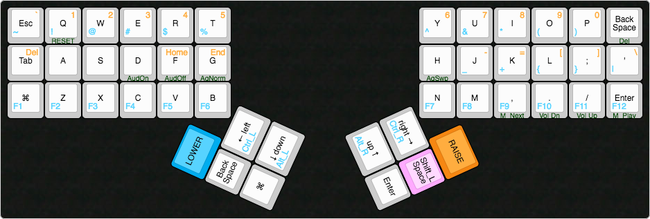

# orthodox-mac-keymap
My keymap for the Orthodox keyboard, optimized for use on a Mac computer.

### Usage

1. Copy `macmap` and its contents into `qmk_firmware/keyboards/orthodox/keymaps`
2. From the qmk root, compile keymap and flash automatically by running:

        make orthodox/rev1:macmap:avrdude

### Keymap

[Interactive keymap](http://www.keyboard-layout-editor.com/##@_name=Orthodox%20Rev.1%201%20(prototype)%20by%20%2F%2Fu%2F%2FDeductivemonkee&author=%2F%2Fu%2F%2Futrrrongeeb&notes=%0A-%20Alternative%20layouts%20(Colemak,%20Dvorak)%20are%20not%20supported%20in%20current%20firmware%0A-%20Front-legends%20(in%20green)%20indicate%20the%20ADJUST%20layer%20functionality%20(Lower%20and%20Raise%20simultaneously)%0A-%20The%20light-magenta%20%22Shift%2F_L%20Space%22%20key%20uses%20QMK's%20MT()%20macro%20to%20send%20Space%20if%20typed%20briefly,%20or%20Shift%20if%20held%20longer%0A-%20This%20KLE%20map%20is%20unofficial,%20and%20consequently%20the%20positioning%20of%20the%20thumb-clusters%20is%20not%20quite%20correct.%20Don't%20try%20to%20make%20a%20plate%20out%20of%20this.&background_name=PBT%20Black&style=background-image%2F:%20url('%2F%2Fbg%2F%2Fplastic%2F%2Fpbt-black.png')%2F%3B%3B&switchMount=cherry&pcb:true&plate:true%3B&@_t=%23000000%0A%2300adef%0A%23f68712%3B&=%0A~%0A%60%0A%0A%0A%0A%0A%0A%0AEsc&_t=%23000000%0A%2300adef%0A%23f68712%0A%0A%23004400%3B&=%0A!%0A1%0A%0ARESET%0A%0A%0A%0A%0AQ&_t=%23000000%0A%2300adef%0A%23f68712%3B&=%0A%2F@%0A2%0A%0A%0A%0A%0A%0A%0AW&=%0A%23%0A3%0A%0A%0A%0A%0A%0A%0AE&=%0A$%0A4%0A%0A%0A%0A%0A%0A%0AR&=%0A%25%0A5%0A%0A%0A%0A%0A%0A%0AT&_x:5%3B&=%0A%5E%0A6%0A%0A%0A%0A%0A%0A%0AY&=%0A%2F&%0A7%0A%0A%0A%0A%0A%0A%0AU&=%0A*%0A8%0A%0A%0A%0A%0A%0A%0AI&=%0A(%0A9%0A%0A%0A%0A%0A%0A%0AO&=%0A)%0A0%0A%0A%0A%0A%0A%0A%0AP&_t=%23000000%0A%0A%0A%0A%23004400&a:7%3B&=Back%20Space%0A%0A%0A%0ADel%3B&@_t=%23000000%0A%0A%23f68712&a:4%3B&=%0A%0ADel%0A%0A%0A%0A%0A%0A%0ATab&_t=%23000000&a:7%3B&=A&=S&_t=%23000000%0A%0A%0A%0A%23004400%3B&=D%0A%0A%0A%0AAudOn&_t=%23000000%0A%0A%23f68712%0A%0A%23004400&a:4%3B&=%0A%0AHome%0A%0AAudOff%0A%0A%0A%0A%0AF&=%0A%0AEnd%0A%0AAgNorm%0A%0A%0A%0A%0AG&_x:5&t=%23000000%0A%0A%0A%0A%23004400&a:7%3B&=H%0A%0A%0A%0AAgSwp&_t=%23000000%0A%2300adef%0A%23f68712&a:4%3B&=%0A%2F_%0A-%0A%0A%0A%0A%0A%0A%0AJ&=%0A+%0A%2F=%0A%0A%0A%0A%0A%0A%0AK&=%0A%7B%0A%5B%0A%0A%0A%0A%0A%0A%0AL&=%0A%7D%0A%5D%0A%0A%0A%0A%0A%0A%0A%2F%3B&=%0A%7C%0A%5C%0A%0A%0A%0A%0A%0A%0A'%3B&@_t=%23000000%0A%2300adef%3B&=%0AF1%0A%0A%0A%0A%0A%0A%0A%0A%E2%8C%98&=%0AF2%0A%0A%0A%0A%0A%0A%0A%0AZ&=%0AF3%0A%0A%0A%0A%0A%0A%0A%0AX&=%0AF4%0A%0A%0A%0A%0A%0A%0A%0AC&=%0AF5%0A%0A%0A%0A%0A%0A%0A%0AV&=%0AF6%0A%0A%0A%0A%0A%0A%0A%0AB&_x:5%3B&=%0AF7%0A%0A%0A%0A%0A%0A%0A%0AN&=%0AF8%0A%0A%0A%0A%0A%0A%0A%0AM&_t=%23000000%0A%2300adef%0A%0A%0A%23004400%3B&=%0AF9%0A%0A%0AM%2F_Next%0A%0A%0A%0A%0A,&=%0AF10%0A%0A%0AVol%20Dn%0A%0A%0A%0A%0A.&=%0AF11%0A%0A%0AVol%20Up%0A%0A%0A%0A%0A%2F%2F&=%0AF12%0A%0A%0AM%2F_Play%0A%0A%0A%0A%0AEnter%3B&@_r:65.5&rx:16&ry:1.63&y:4.12&x:-0.25&c=%23f68712&t=%23000000&a:7&w:1.25%3B&=RAISE%3B&@_x:-1.25&c=%23cccccc&t=%23000000%0A%2300adef&a:4&w:1.25%3B&=%0ACtrl%2F_R%0A%0A%0A%0A%0A%0A%0A%0Aright%20%2F&rarr%2F%3B&_c=%23ffaaff&t=%23000000&a:7%3B&=Shift%2F_L%20Space%3B&@_x:-1.25&c=%23cccccc&t=%23000000%0A%2300adef&a:4&w:1.25%3B&=%0AAlt%2F_R%0A%0A%0A%0A%0A%0A%0A%0Aup%20%2F&uarr%2F%3B&_t=%23000000&a:7%3B&=Enter%3B&@_r:-65.5&rx:1&y:4.12&x:-1&c=%2300adef&w:1.25%3B&=LOWER%3B&@_x:-1&c=%23cccccc%3B&=Back%20Space&_t=%23000000%0A%2300adef&a:4&w:1.25%3B&=%0ACtrl%2F_L%0A%0A%0A%0A%0A%0A%0A%0A%2F&larr%2F%3B%20left%3B&@_x:-1&t=%23000000&a:7%3B&=%E2%8C%98&_t=%23000000%0A00adef&a:4&w:1.25%3B&=%0AAlt%2F_L%0A%0A%0A%0A%0A%0A%0A%0A%2F&darr%2F%3B%20down)

### Reference 

Refer to the original [QMK Orthodox source](https://github.com/qmk/qmk_firmware/tree/master/keyboards/orthodox) for additional information.